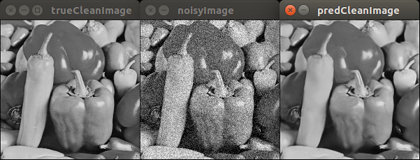

# KerasDnCNN
Keras implementation of DnCNN-S. Originaly as proposed by Zhang et al in the paper [Beyond a Gaussian Denoiser: Residual Learning of Deep CNN for Image Denoising](http://www4.comp.polyu.edu.hk/~cslzhang/paper/DnCNN.pdf).
This implementation is only for DnCNN-S (Specified noise level).

## Functionality
- This project is  useful to denoise an image, if the noise level in an image is known or estimated. 

- This project is also useful to know **"How to create custom loss, custom real time data-augmentation flow and custom learning rate scheduler in keras?"**, check kDnCNN.py for that, I had a hard time figuring it out  myself.

## Requirments
- python 3, keras 2(tf-backend), OpenCV 3 were being used for development.

## Commands
``` shell
$ python generateData.py    #this will create new folder name trainingPatch containg image patches.
$ python kDnCNN.py    #to train, and it saves model myModel.h5 in your working directory.
$ python testPSNR.py --dataPath /path/to/test/dataset/ --weightsPath /path/to/myModel.h5    #to calculate avg PSNR on test data
```
## Results

- I have used Set12/ dataset for testing. Avg PSNR(dB)

| Noise Level | DnCNN-S |     KDnCNN-S     |
|:-----------:|:-------:|:----------------:|
| 25          | 30.4    |       28.3       |

- NOTE: Any suggestion to improve performance of KDnCNN-S to make it at par with original DnCNN-S is welcomed.

